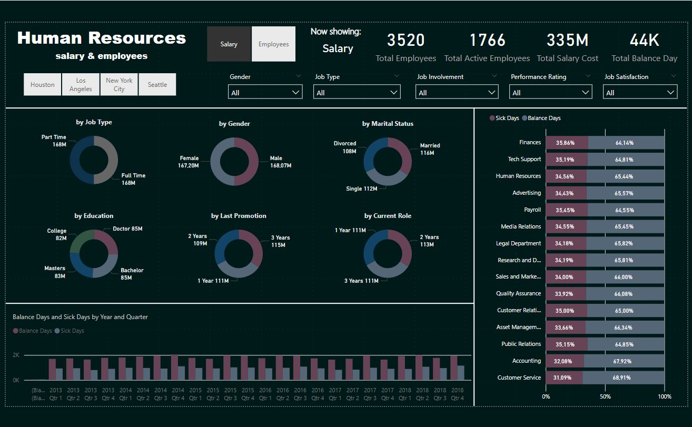
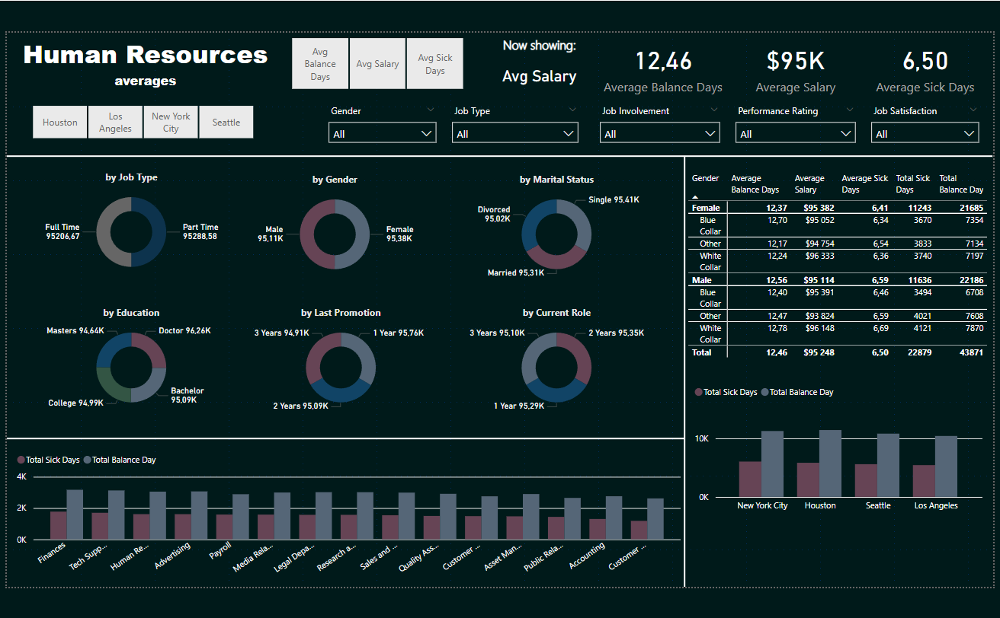
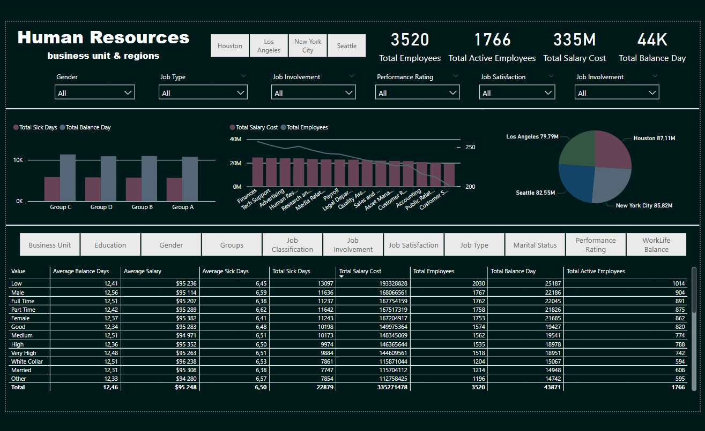

# Projekt Power BI: Analiza Zasobów Ludzkich

## Opis projektu

Ten projekt przedstawia analizę danych dotyczących zasobów ludzkich, w tym wynagrodzeń, szczegółów dotyczących pracowników oraz wskaźników wydajności. Dashboard został stworzony w Power BI i zawiera różne wizualizacje, które pomagają zrozumieć rozkład pracowników, koszty wynagrodzeń oraz trendy w czasie.

## Funkcje projektu

- **Analiza wynagrodzeń** – przegląd kosztów wynagrodzeń i liczby pracowników
- **Statystyki dotyczące pracowników** – podział według typu pracy, płci, poziomu edukacji, stażu pracy i innych kryteriów
- **Ocena wydajności** – analiza zadowolenia z pracy, dni chorobowych oraz bilansu dni wolnych
- **Porównanie jednostek biznesowych i regionów** – porównanie danych w różnych lokalizacjach

## Zrzuty ekranu z dashboardu

### 1. Przegląd wynagrodzeń i pracowników

### 2. Średnie wynagrodzenia i dni chorobowe

### 3. Analiza według jednostek biznesowych i regionów

## Pobierz raport Power BI

[Pobierz plik .pbix](./Human_Resources.pbix)
